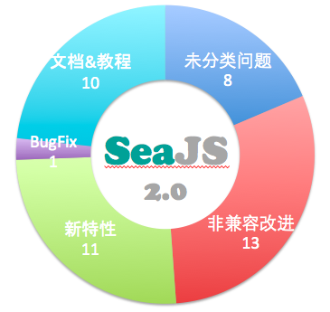
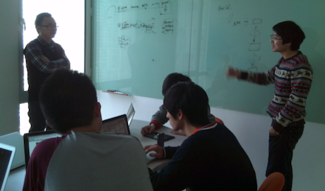

# 基础技术组产品快报-第6期

- pubdate: 2013-01-29

----

## 一、SeaJS 2.0 进行时！

由于涉及重要的非兼容性修改以及插件的独立化，将直接从 1.3 升级至 2.0。

新的版本将把精力集中在：

1. **做减法：** 根据实际使用情况，将过度设计或不合理的功能去掉。
2. **可扩展：** 插件机制的完善，以及插件的独立化。

具体包括：

所有编码工作预计将在春节放假前完成。

更多内容请访问 [2.0 MileStone](https://github.com/seajs/seajs/issues/451) ，赶紧看看有没有你感兴趣的新特性吧：）

## 二、Alice 整合至 Arale 提上日程

你有郁闷组件的css和js要分开管理和使用不太方便么？

你有琢磨过使用css3新特性，对全站实施渐进增强么？

你需要一套完整的官方样式库，即拿即用么？

有过以上疑问的同学推荐关注此讨论 [Alice 现状和未来](https://github.com/aralejs/aralejs.org/issues/230)，讨论包含以下内容：

- Alice 是什么？
- 为什么要把 Alice 整合至 Arale？
- 准备增加哪些新特性？
- 初步的开发计划

欢迎围观、拍砖、各种吐槽和建议等等。

## 三、spmjs.org

我们一直想要一个像 npmjs.org 这样的站点，让大家可以自由地发布和共享自己的 cmd 模块，但苦于没有足够的人手去做这件事情，现在终于启动了。本周大家进行了一些方向上的讨论。

这确实不是意一件简单的事情，等待第一个可用版本的时间可能有点长，不过至少能看到希望鸟。

---

往期快报请 [猛击这里](https://github.com/alipay/wd-public/issues?labels=tech-news&page=1&state=closed)

本邮件2周一发，原则上风雨无阻，不排除偶尔忘记，我们欢迎不靠谱的吐槽，更欢迎靠谱的建议，单独回复本邮件即可。
